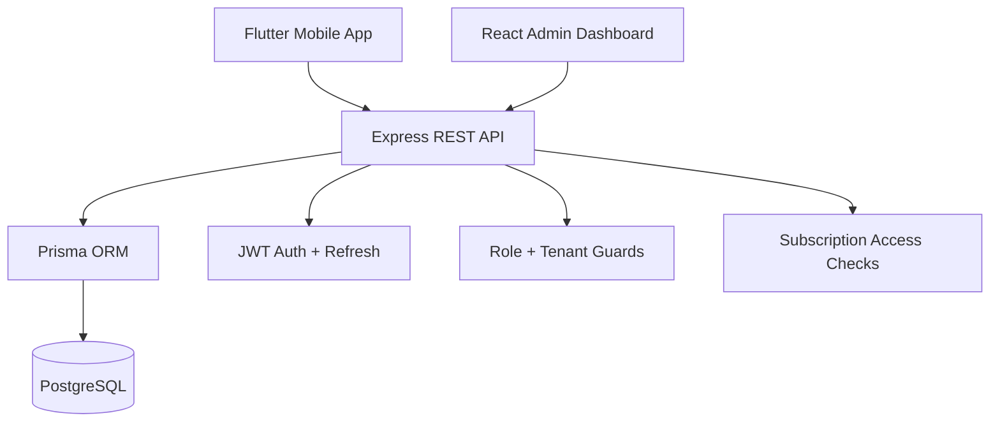

# MedRush Challenge Architecture

MedRush Challenge is a multi-tenant SaaS educational medical game platform with three deployable applications:

- `backend/`: Node.js, Express, PostgreSQL, Prisma, JWT, RBAC, Swagger-ready REST API.
- `admin-dashboard/`: React, TypeScript, Vite, Tailwind CSS SaaS dashboard for super admins, institution admins, and teachers.
- `mobile-app/`: Flutter app for Android and iOS with Riverpod, Dio, local cache, themes, and English/Arabic/French localization.

## Backend stack choice

I chose **Node.js + Express + PostgreSQL + Prisma** over FastAPI for this product because:

1. Prisma provides a strongly modeled schema and a fast seed/migration workflow for a broad SaaS domain.
2. The React dashboard can share TypeScript-oriented API contracts and payload shapes more naturally.
3. Express is lightweight and fits a modular REST API for mobile/admin clients.
4. The ecosystem has mature JWT, RBAC, validation, Docker, and deployment tooling.

## High-level system

## Multi-tenant model

- Every non-super-admin user belongs to one institution.
- Institution-scoped users can only access their own institution content, users, payments, leaderboard, and reports.
- Global content has `institutionId = null` and can be consumed by any allowed user.
- Institution content has `institutionId` set and is private to that institution.

## Roles

- `SUPER_ADMIN`: global platform owner.
- `INSTITUTION_ADMIN`: manages own institution, students, teachers, subscription status, content, and reports.
- `TEACHER`: creates quizzes, questions, clinical cases, and views performance for own institution.
- `STUDENT`: uses the mobile game app.

## Medical safety

All medical content is educational only. The mobile app and documentation display:

> This application is for educational purposes only. It does not provide medical diagnosis or treatment and does not replace professional medical advice.

## Main backend domains

- Auth: register, login, refresh, logout, forgot/reset password, current user.
- Institutions: CRUD, suspension, code generation.
- Users: CRUD, suspend, reset password, profile.
- Quizzes/questions/cases: CRUD, filters, daily challenge, random questions, premium access.
- Gamification: XP, levels, coins, streaks, badges, achievements.
- Leaderboards: daily, weekly, monthly, institution, global.
- Subscriptions/payments: plans, manual payments, expiry/status checks, premium restrictions.
- Reports: platform, institution, quiz, student, category analytics.
- Notifications: user notifications and read state.

## Production deployment path

- Backend: containerized Express API behind HTTPS load balancer.
- Database: managed PostgreSQL.
- Admin dashboard: static build on CDN/Vercel/Netlify or served by Nginx container.
- Mobile app: Android APK/AAB and iOS archive using Flutter build commands.
- Payments: existing schema is payment-ready; add Stripe/PayPal provider adapters under `backend/src/services/payments`.
